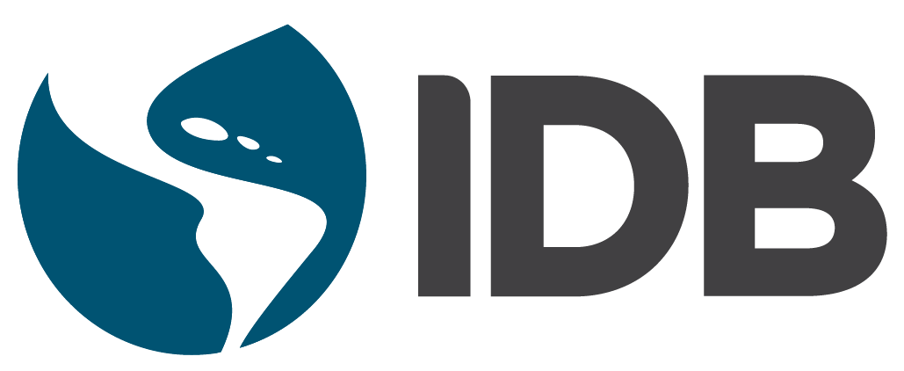

<!-- BUTTON FOCUS FIX -->

<!-- PART 1. VIDEO + TAGLINE -->

<video autoplay muted loop playsinline>
<source src="assets/media/caribdata5.mp4" type="video/mp4">
</video>

Welcome to CaribData Stories  
Powered by data, shaped by people.

<!-- PART 2. PITCH. -->

# We work at the intersection of people, data, and technology—using evidence to ask better questions, challenge easy answers, and deepen understanding. Each chart, table, and story is an invitation to explore. {.hero-heading1} 

[Read our latest stories](stories/){ .md-button }

<!-- PART 3. INFRASTRUCTURE -->

# Our Data Infrastructure {.hero-heading1}
## We've developed platforms for electronic data capture, for data sharing, and for training {.hero-heading1}

-   :fontawesome-solid-pen-to-square:{ .middle .hero-heading2} __REDCap__{ .middle .hero-heading1}

    <a href="https://caribdata.org/redcap" target="_blank" rel="noopener" class="md-button-external">
    Capture Your Data. Securely. </a>

-   :fontawesome-solid-folder-open:{ .middle .hero-heading2} __Zenodo__{ .middle .hero-heading1}
    
    <a href="https://zenodo.org/communities/caribdata" target="_blank" rel="noopener" class="md-button-external">
    Your Data. Ready To Share. </a>

-   :fontawesome-solid-graduation-cap:{ .middle .hero-heading2} __Moodle__{ .middle .hero-heading1}

    <a href="https://moodle.caribdata.org/lms/login/" target="_blank" rel="noopener" class="md-button-external">
    Data Training for Insights. </a>

<!-- PART 4. OUR TRAINING -->

# Our Data Training {.hero-heading1}
## We offer practical training for data capture, storytelling, and responsible sharing. {.hero-heading1}

- <a href="https://moodle.caribdata.org/lms/login/" target="_blank" rel="noopener" class="md-button-external">
    Build Skills. Build Impact. </a>
    

<!-- PART 5. OUR PARTNERS -->

  Supported by:
  
  

