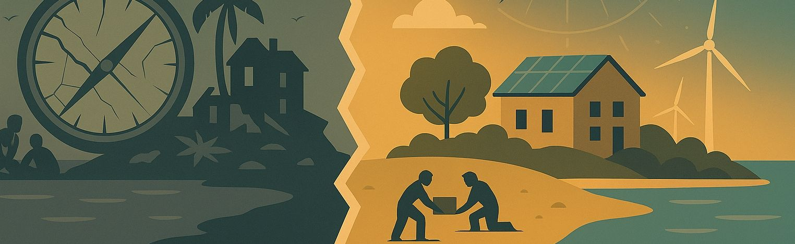
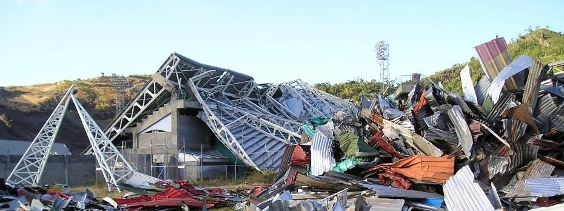

---
date:
  created: 2025-04-30
  updated: 2025-07-18
draft: false
categories:
  - Stories
tags:
  - data
  - climate
  - caribbean
  - sids
authors:
  - ian

slug: why-small-islands-need-data
---

# Charting the Course: Why Small Islands Need Big Data

<!-- more -->

## The Data Dilemma

Imagine steering a ship through a storm with no map, no compass—just instincts and hope. This is the challenge facing Small Island Developing States (SIDS) as they navigate crises like climate change, economic instability, and disaster recovery.

Without reliable data, decision-making becomes guesswork, and nations struggle to protect their people. But how does this data gap impact real lives? Let’s start with a story from Grenada.

## The Aftermath of Hurricane Ivan
In 2004, Hurricane Ivan devastated Grenada, leaving 90% of homes damaged or destroyed. 

<em style="font-size: 0.8em; color: #666;">Galvanise/Zinc blown from the roofs of surrounding houses litter the grounds of the destroyed National Athletic Stadium. Photo: Ian Blaikie  
</em>

The experience during and after the hurricane was a traumatic one. Welles Henderson, a medical student at St. George’s University, described his experience, 

!!! quote "Welles Henderson" 

    We'd barricaded ourselves with a dining room table and furniture from our living room and put a carpet over the top of us to protect us from glass shards as our roof got ripped off above us.[^1] 

For many businesses and industries, the hurricane was devastating for livelihoods and economies.

!!! quote "Business Owners"

    === "Nutmeg Farmer, John Branch"
    
        Ninety-five percent of our nutmegs were destroyed, plus roads and access to the remaining fields. You could see us abandon some fields and depend mainly on the tourists, the cruise ship trade as a source of income to pay the workers[^2]. 

    === "Hotelier, Russ Felden"

        Roofs were blown off and flying about like playing cards. Guests were huddling in their bathrooms, holding mattresses over their heads. The damage cost more than £500,000 and, of course, I wasn't properly insured [^3]. 

In the chaos that followed, the government faced urgent questions. How many people are homeless, and how can we help them now and later, where should we rebuild first, and looking ahead what areas are most vulnerable to the next storm?

Gaps in what was now crucial information included out-of-date housing and population data. Relief agencies struggled to identify the hardest-hit areas. Aid was misallocated, and the recovery process dragged on.

## Why Are SIDS Struggling With Data?
A 2024 University of the West Indies study highlighted that just two-thirds of the globally recognised Sustainable Development Goal indicators are reliably tracked across the Caribbean — far behind the global average of 80%. For gender-related information, the situation is worse, with only one-third of indicators maintained by the world's development agencies reported by the Caribbean SIDS.

<!-- Image of Data Availability graphicm created by Ian Hambleton in DataWrapper, May 2025 -->
<iframe title="Data availability for 8 world regions, 2022" aria-label="Table" id="datawrapper-chart-tvZnF" src="https://datawrapper.dwcdn.net/tvZnF/1/" scrolling="no" frameborder="0" style="width: 0; min-width: 100% !important; border: none;" height="475" data-external="1"></iframe>

A key reason for the region’s data gaps is the limited budgets and capacity in small communities, where slow, costly data collection and urgent crises often push long-term data systems down the priority list.

!!! quote "Linda Peters, global business development manager for Official Statistics at Esri"

    Grenada’s government had stores of raw geospatial data in the office of the Ministry of Agriculture and Lands, however, there was no way to organize all this valuable information

## A Regional Path Forward

Despite the challenges, small island states are making bold strides—from Grenada’s real-time 3D modelling platform for climate planning to region-wide efforts that combine satellite, ocean, and sensor data to support evidence-based decision-making[^4].

Other Caribbean countries are also strengthening their data systems. In Jamaica, partnerships with organizations such as the United Nations have helped improve the collection and analysis of data on gender and economic inequality. These efforts are equipping policymakers with the evidence needed to make more targeted decisions—ensuring support reaches those most affected[^5].

At a regional level, CARICOM is playing a pivotal role. By creating frameworks for shared data collection and analysis, member states are working together to overcome the limitations of size. The goal is simple: to ensure every nation has the tools it needs to shape its own future.

## Why It Matters
Hurricanes like Ivan are just one example of why data matters. The Caribbean faces global challenges like climate change, rising sea levels, and economic instability—problems that are magnified by a lack of reliable information. When data is missing, governments are forced to act reactively, not proactively. And the consequences are felt not just locally, but globally. SIDS, often on the frontlines of these crises, serve as a warning system for the world. The lessons learned here can inform strategies for resilience and sustainability everywhere.

Managing a country without reliable data is like navigating a storm without a map. Caribbean nations must continue investing in data infrastructure, training, and regional cooperation. If we ignore this, the consequences are clear:

- Slower disaster recovery → More lives lost, higher economic damage.
- Poor resource allocation → Misplaced aid, inefficient policies.
- Lack of global competitiveness → Weak economic strategies.

Investing in data is not about numbers—it’s about saving lives, protecting communities, and ensuring a sustainable future.
Communities have a role to play. Participating in and providing accurate information in census surveys and research studies can directly impact the way that governments shape policy, provide services and responds to disaster.
We know the storms are coming; let’s make sure we have an accurate map.

??? info- "About CaribData"

    CaribData is dedicated to transforming data sharing and storytelling across the Caribbean. The project aims to build a regional infrastructure for data exchange, provide training and mentorship to strengthen data handling capacity, and promote open data through visualization and storytelling. By collaborating with researchers, statisticians, and organizations, we make data more accessible and impactful. CaribData is currently funded by the Inter-American Development Bank (IDB).

    We’re actively seeking passionate storytellers and data enthusiasts who can work with us to create compelling narratives. If you see the magic in data storytelling, we want to connect with you! [Email us](mailto:caribdata.comms@gmail.com) and let’s explore how we can collaborate.

[^1]: [Ivan In Grenada: Survivor’s Tale](https://www.cbsnews.com/news/ivan-in-grenada-a-survivorstale/){:target="_blank"}
[^2]: [Grenada/Hurricane Recovery](https://media.un.org/unifeed/en/asset/u100/u100522a){:target="_blank"}
[^3]: [Grenada: A Caribbean Comeback](https://www.thetimes.com/travel/destinations/caribbean-travel/grenada-a-caribbean-comeback-xrb0792clv6?region=global){:target="_blank"}
[^4]: [Esri: Grenada’s Digital Twin for Climate Resilience](https://www.esri.com/about/newsroom/blog/grenada-digital-twin-climate-change){:target="_blank"} 
[^5]: [UN Women: Jamaica launches National Gender Equality Survey results (2023)](https://www.unwomen.org/en/news-stories/news/2023/02/jamaica-launches-national-gender-equality-survey-results){:target="_blank"}
