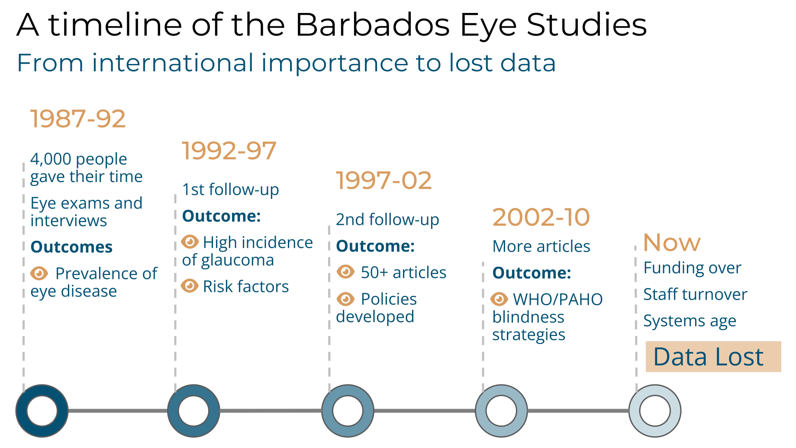

---
date:
  created: 2025-05-31
  updated: 2025-07-18
draft: false
categories:
  - Stories
tags:
  - data
  - caribbean
  - sids
authors:
  - ian

slug: Rethinking Caribbean Data Use
---

# Rethinking Data Use in the Caribbean
## From Missed Opportunities to Shared Solutions

<!-- more -->

In public health, breakthroughs can come from noticing small details: a timely phone call that clarifies a statistic, a corrected data point that sparks fresh insight, or a report delivered to the very people who can act on it. These moments rarely make the headlines, yet they can transform how we understand—and improve—the health of our communities. Across the Caribbean, we have abundant talent and world-class research; by refining how we collect, interpret and share our data, we can unlock our full potential. When every piece of information finds its way to the right hands, what could we achieve together? 

Beneath every successful public-health initiative lies reliable, up-to-date data. While the Caribbean has historically lagged in gathering and refreshing the indicators needed to monitor regional concerns - such as the Sustainable Development Goals and gender inequality - this gap represents a great opportunity. 

<noscript></noscript>

By strengthening national data systems—so that essential metrics are collected, updated, and shared on schedule—we can turn planning from approximation into targeted action. With statistics at our fingertips, we’ll be able to design smarter interventions, mobilize resources more efficiently, and track our progress over time. When our data reflects the depth and diversity of our communities, it becomes a stronger foundation for collective progress.

This data ideal will involve a collective journey, so let’s take a closer look at what can happen when we don’t value our data resources. For twenty years from the early 1990s, the Barbados Eye Studies followed more than 4,000 people and produced important findings about eye health in people of African descent. The data shaped international policies and research for years. When the study ended, the team moved on, computer systems aged, and over time the data was forgotten. Today, its whereabouts are unknown — valuable knowledge lost, not because it lacked importance, but because there were no systems in place to ensure its long-term preservation and reuse.

In another example from 2015, the Global Burden of Disease study reported that Barbados had one of the healthiest diets in the world[^1]. The data behind that claim came from a small group of cancer survivors. So the data were important, but not representative of the whole country. This finding gained international attention, despite local research showing that Barbados faces serious diet-related health challenges, like low fruit and vegetable intake and rising rates of obesity[^2]. The mismatch highlights the danger of presenting information without the benefit of local insight.

When COVID-19 struck, everyone—from governments to frontline health workers—rose to meet the challenge. Our team of epidemiologists reported on the Caribbean infection rates each morning, piecing together daily information from dozens of separate sources[^3]. This puzzle of fragmented data was a consequence of limited resources and decentralized systems. We persisted and mostly succeeded, but we could have done so much more with shared platforms and stronger data infrastructure. By bringing our information streams together, we can respond faster—and with greater coordination—when the next health emergency arrives.

!!! quote "Dr Madhuvanti Murphy, member of the Barbados COVID Response Team"

    Not only was the COVID experience traumatic from a lay person’s standpoint, but it was also traumatic from a surveillance standpoint. It was so difficult to work out which were the appropriate surveillance tools and platforms to look at and then to make sure everything aligned. Different sources were presenting information in different ways, which made it really difficult to find any one way to collate all of that information. If there was something more streamlined from a data perspective, it would have made it so much easier for us to really be on top of the surveillance in a way that would have allowed us to do more with the data.

These opportunities go beyond simply filling data gaps or speeding up processes—they’re about building stronger support, developing lasting connections, and harnessing our shared commitment to make data serve the region. When we invest in unified platforms and proper data stewardship, the statistics we collect become a lasting asset. By linking health and development databases—and equipping our researchers with the right tools, time, and resources—we’ll encourage insights across borders and disciplines. In doing so, we’ll turn isolated findings into collective progress and – eventually - make our data work for everyone.

CaribData has been set up to help this process. It’s an initiative led by the University of the West Indies, with support from the Inter-American Development Bank, and its mission is simple: to help the Caribbean make better use of the data it already has. That means setting up systems to protect and share data securely, offering training to help researchers communicate their results more clearly, and building a culture of sharing across ministries, universities, and communities. Most importantly, CaribData is about telling better stories with data—ones that reflect local knowledge, inform real decisions, and build trust.

Because this isn’t just about data for data’s sake. It’s about using evidence to improve lives. With the right systems and support, the Caribbean can ensure that local research helps shape local solutions—and contribute to global conversations with confidence. CaribData is helping to make that future possible: one where strong data leads to smart choices, and where Caribbean voices are heard, respected, and empowered.

??? info- "About CaribData"

    CaribData is dedicated to transforming data sharing and storytelling across the Caribbean. The project aims to build a regional infrastructure for data exchange, provide training and mentorship to strengthen data handling capacity, and promote open data through visualization and storytelling. By collaborating with researchers, statisticians, and organizations, we make data more accessible and impactful. CaribData is currently funded by the Inter-American Development Bank (IDB).

    We’re actively seeking passionate storytellers and data enthusiasts who can work with us to create compelling narratives. If you see the magic in data storytelling, we want to connect with you! [Email us](mailto:caribdata.comms@gmail.com) and let’s explore how we can collaborate.

[^1]: [(Imamura 2015) Dietary quality among men and women in 187 countries in 1990 and 2010: a systematic assessment](https://doi.org/10.1016/s2214-109x(14)70381-x){:target="_blank"}

[^2]: [Hambleton (2015). Global trends in dietary quality](https://doi.org/10.1016/s2214-109x(15)00082-0){:target="_blank"}

[^3]:[Hambleton (2020). COVID-19 in the Caribbean small island developing states: lessons learnt from extreme weather events](https://doi.org/10.1016/s2214-109x(20)30291-6){:target="_blank"}
